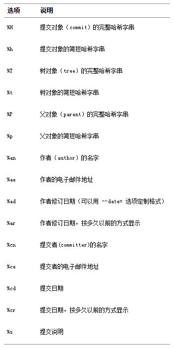
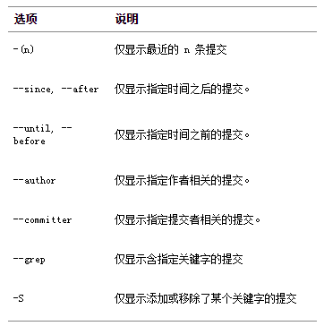

## 2.3 查看提交历史

在提交了若干更新，又或者克隆了某个项目之后，你也许想回顾下提交历史. 完成这个任务最简单而又有效的工具是 git log 命令。

接下来的例子会用我专门用于演示的 simplegit 项目， 运行下面的命令获取该项目源代码：

```
git clone https://github.com/schacon/simplegit-progit
```

然后在此项目中运行 git log，应该会看到下面的输出：

```
$ git log
commit ca82a6dff817ec66f44342007202690a93763949
Author: Scott Chacon <schacon@gee-mail.com>
Date:   Mon Mar 17 21:52:11 2008 -0700

    changed the version number

commit 085bb3bcb608e1e8451d4b2432f8ecbe6306e7e7
Author: Scott Chacon <schacon@gee-mail.com>
Date:   Sat Mar 15 16:40:33 2008 -0700

    removed unnecessary test

commit a11bef06a3f659402fe7563abf99ad00de2209e6
Author: Scott Chacon <schacon@gee-mail.com>
Date:   Sat Mar 15 10:31:28 2008 -0700

    first commit
```

默认不用任何参数的话，git log 会按提交时间列出所有的更新，最近的更新排在最上面。 正如你所看到的，这个命令会列出每个提交的 SHA-1 校验和、作者的名字和电子邮件地址、提交时间以及提交说明。

git log 有许多选项可以帮助你搜寻你所要找的提交， 接下来我们介绍些最常用的。

一个常用的选项是 -p，用来显示每次提交的内容差异。 你也可以加上 -2 来仅显示最近两次提交：

```
$ git log -p -2
commit ca82a6dff817ec66f44342007202690a93763949
Author: Scott Chacon <schacon@gee-mail.com>
Date:   Mon Mar 17 21:52:11 2008 -0700

    changed the version number

diff --git a/Rakefile b/Rakefile
index a874b73..8f94139 100644
--- a/Rakefile
+++ b/Rakefile
@@ -5,7 +5,7 @@ require 'rake/gempackagetask'
 spec = Gem::Specification.new do |s|
     s.platform  =   Gem::Platform::RUBY
     s.name      =   "simplegit"
-    s.version   =   "0.1.0"
+    s.version   =   "0.1.1"
     s.author    =   "Scott Chacon"
     s.email     =   "schacon@gee-mail.com"
     s.summary   =   "A simple gem for using Git in Ruby code."

commit 085bb3bcb608e1e8451d4b2432f8ecbe6306e7e7
Author: Scott Chacon <schacon@gee-mail.com>
Date:   Sat Mar 15 16:40:33 2008 -0700

    removed unnecessary test

diff --git a/lib/simplegit.rb b/lib/simplegit.rb
index a0a60ae..47c6340 100644
--- a/lib/simplegit.rb
+++ b/lib/simplegit.rb
@@ -18,8 +18,3 @@ class SimpleGit
     end

 end
-
-if $0 == __FILE__
-  git = SimpleGit.new
-  puts git.show
-end
\ No newline at end of file
```

该选项除了显示基本信息之外，还在附带了每次 commit 的变化。 当进行代码审查，或者快速浏览某个搭档提交的 commit 所带来的变化的时候，这个参数就非常有用了。 你也可以为 git log 附带一系列的总结性选项。 比如说，如果你想看到每次提交的简略的统计信息，你可以使用 --stat 选项：

```
$ git log --stat
commit ca82a6dff817ec66f44342007202690a93763949
Author: Scott Chacon <schacon@gee-mail.com>
Date:   Mon Mar 17 21:52:11 2008 -0700

    changed the version number

 Rakefile | 2 +-
 1 file changed, 1 insertion(+), 1 deletion(-)

commit 085bb3bcb608e1e8451d4b2432f8ecbe6306e7e7
Author: Scott Chacon <schacon@gee-mail.com>
Date:   Sat Mar 15 16:40:33 2008 -0700

    removed unnecessary test

 lib/simplegit.rb | 5 -----
 1 file changed, 5 deletions(-)

commit a11bef06a3f659402fe7563abf99ad00de2209e6
Author: Scott Chacon <schacon@gee-mail.com>
Date:   Sat Mar 15 10:31:28 2008 -0700

    first commit

 README           |  6 ++++++
 Rakefile         | 23 +++++++++++++++++++++++
 lib/simplegit.rb | 25 +++++++++++++++++++++++++
 3 files changed, 54 insertions(+)
```

正如你所看到的，--stat 选项在每次提交的下面列出额所有被修改过的文件、有多少文件被修改了以及被修改过的文件的哪些行被移除或是添加了。 在每次提交的最后还有一个总结。

另外一个常用的选项是 --pretty。 这个选项可以指定使用不同于默认格式的方式展示提交历史。 这个选项有一些内建的子选项供你使用。 比如用 oneline 将每个提交放在一行显示，查看的提交数很大时非常有用。 另外还有 short，full 和 fuller 可以用，展示的信息或多或少有些不同，请自己动手实践一下看看效果如何。

```
$ git log --pretty=oneline
ca82a6dff817ec66f44342007202690a93763949 changed the version number
085bb3bcb608e1e8451d4b2432f8ecbe6306e7e7 removed unnecessary test
a11bef06a3f659402fe7563abf99ad00de2209e6 first commit
```

但最有意思的是 format，可以定制要显示的记录格式。 这样的输出对后期提取分析格外有用 — 因为你知道输出的格式不会随着Git的更新而发生改变：

```
$ git log --pretty=format:"%h - %an, %ar : %s"
ca82a6d - Scott Chacon, 6 years ago : changed the version number
085bb3b - Scott Chacon, 6 years ago : removed unnecessary test
a11bef0 - Scott Chacon, 6 years ago : first commit
```

Table 2-1 列出了常用的格式占位符写法及其代表的意义。

Table 2-1. git log --pretty=format 常用的选项



你一定奇怪 作者 和 提交者 之间究竟有何差别， 其实作者指的是实际作出修改的人，提交者指的是最后将此工作成果提交到仓库的人。 所以，当你为某个项目发布补丁，然后某个核心成员将你的补丁并入项目时，你就是作者，而那个核心成员就是提交者。 我们会在 分布式 Git 再详细介绍两者之间的细微差别。

当 oneline 或 format 与另一个 log 选项 --graph 结合使用时尤其有用。 这个选项添加了一些ASCII字符串来形象地展示你的分支、合并历史：

```
$ git log --pretty=format:"%h %s" --graph
* 2d3acf9 ignore errors from SIGCHLD on trap
*  5e3ee11 Merge branch 'master' of git://github.com/dustin/grit
|\
| * 420eac9 Added a method for getting the current branch.
* | 30e367c timeout code and tests
* | 5a09431 add timeout protection to grit
* | e1193f8 support for heads with slashes in them
|/
* d6016bc require time for xmlschema
*  11d191e Merge branch 'defunkt' into local
```

这种输出类型会在我们下一张学完分支与合并以后变得更加有趣。

以上只是简单介绍了一些 git log 命令支持的选项。 Table 2-2 列出了我们目前涉及到的和没涉及到的选项，已经它们是如何影响 log 命令的输出的：

Table 2-2. git log 的常用选项


### 限制输出长度

除了定制输出格式的选项之外，git log 还有许多非常实用的限制输出长度的选项，也就是只输出部分提交信息。 之前你已经看到过 -2 了，它只显示最近的两条提交， 实际上，这是 -<n> 选项的写法，其中的 n 可以是任何整数，表示仅显示最近的若干条提交。 不过实践中我们是不太用这个选项的，Git 在输出所有提交时会自动调用分页程序，所以你一次只会看到一页的内容。

另外还有按照时间作限制的选项，比如 --since 和 --until 也很有用。 例如，下面的命令列出所有最近两周内的提交：

```
$ git log --since=2.weeks
```

这个命令可以在多种格式下工作，比如说具体的某一天 "2008-01-15"，或者是相对地多久以前 "2 years 1 day 3 minutes ago"。

还可以给出若干搜索条件，列出符合的提交。 用 --author 选项显示指定作者的提交，用 --grep 选项搜索提交说明中的关键字。 （请注意，如果要得到同时满足这两个选项搜索条件的提交，就必须用 --all-match 选项。否则，满足任意一个条件的提交都会被匹配出来）

另一个非常有用的筛选选项是 -S，可以列出那些添加或移除了某些字符串的提交。 比如说，你想找出添加或移除了某一个特定函数的引用的提交，你可以这样使用：

```
$ git log -Sfunction_name
```

最后一个很实用的 git log 选项是路径(path)， 如果只关心某些文件或者目录的历史提交，可以在 git log 选项的最后指定它们的路径。 因为是放在最后位置上的选项，所以用两个短划线（--）隔开之前的选项和后面限定的路径名。

在 Table 2-3 中列出了常用的选项

Table 2-3. 限制 git log 输出的选项



来看一个实际的例子，如果要查看 Git 仓库中，2008 年 10 月期间，Junio Hamano 提交的但未合并的测试文件，可以用下面的查询命令：

```
$ git log --pretty="%h - %s" --author=gitster --since="2008-10-01" \
   --before="2008-11-01" --no-merges -- t/
5610e3b - Fix testcase failure when extended attributes are in use
acd3b9e - Enhance hold_lock_file_for_{update,append}() API
f563754 - demonstrate breakage of detached checkout with symbolic link HEAD
d1a43f2 - reset --hard/read-tree --reset -u: remove unmerged new paths
51a94af - Fix "checkout --track -b newbranch" on detached HEAD
b0ad11e - pull: allow "git pull origin $something:$current_branch" into an unborn branch
```

在近40000条提交中，上面的输出仅列出了符合条件的6条记录。